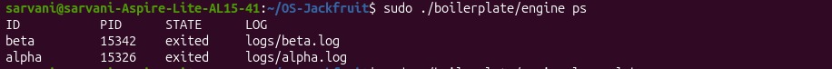
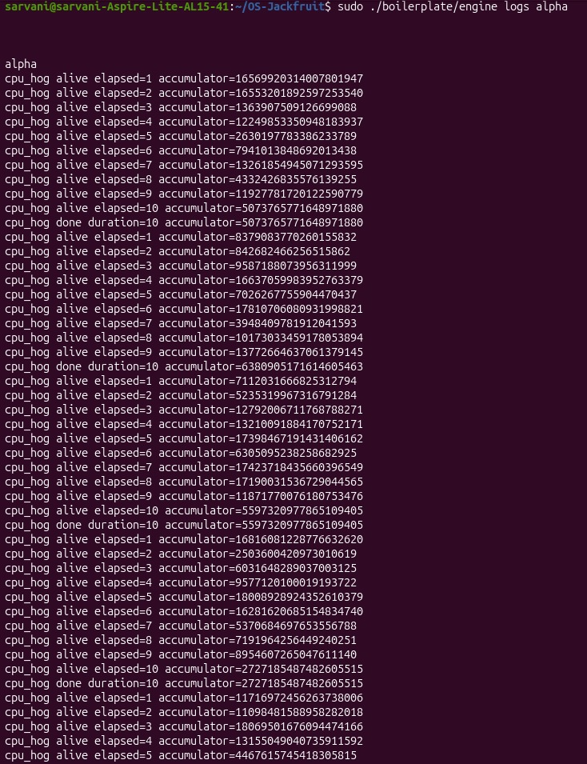
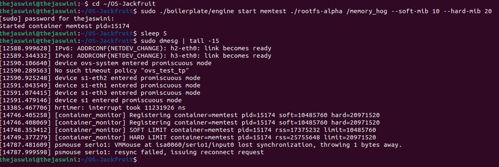
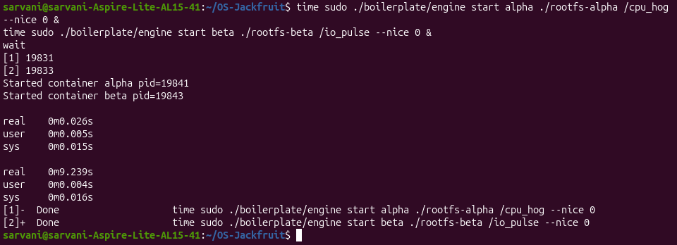
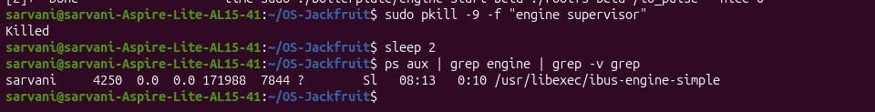

# Multi-Container Runtime

A lightweight Linux container runtime in C with a long-running supervisor and a kernel-space memory monitor.

---

## 1. Team Information

| Name | SRN |
|------|-----|
| Upadrasta Naga Sarvani | PES2UG24CS567 |
| Thejaswini | PES2UG24CS563 |

---

## 2. Build, Load, and Run Instructions

### Build
```bash
cd boilerplate
make
```

### Load Kernel Module
```bash
sudo insmod boilerplate/monitor.ko
ls -l /dev/container_monitor
```

### Prepare Root Filesystems
```bash
mkdir rootfs-base
wget https://dl-cdn.alpinelinux.org/alpine/v3.20/releases/x86_64/alpine-minirootfs-3.20.3-x86_64.tar.gz
tar -xzf alpine-minirootfs-3.20.3-x86_64.tar.gz -C rootfs-base
cp -a ./rootfs-base ./rootfs-alpha
cp -a ./rootfs-base ./rootfs-beta
cp boilerplate/cpu_hog rootfs-alpha/
cp boilerplate/memory_hog rootfs-alpha/
cp boilerplate/io_pulse rootfs-beta/
```

### Start Supervisor
```bash
sudo ./boilerplate/engine supervisor ./rootfs-base
```

### Launch Containers (in a second terminal)
```bash
sudo ./boilerplate/engine start alpha ./rootfs-alpha /bin/hostname
sudo ./boilerplate/engine start beta ./rootfs-beta /bin/hostname
sudo ./boilerplate/engine ps
sudo ./boilerplate/engine logs alpha
sudo ./boilerplate/engine stop alpha
```

### Run Command (blocks until container exits)
```bash
sudo ./boilerplate/engine run gamma ./rootfs-alpha /bin/hostname
```

### Unload Module and Clean Up
```bash
sudo pkill -f "engine supervisor"
sudo rmmod monitor
```

### Verify Clean Teardown
```bash
ps aux | grep engine | grep -v grep
dmesg | tail -5
```

---

## 3. Demo Screenshots

### Screenshot 1 — Multi-container supervision
Two containers (alpha, beta) running under one supervisor process, showing `ps` output.



### Screenshot 2 — Metadata tracking
Output of `ps` command showing container ID, PID, state, and log path for tracked containers.


### Screenshot 3 — Bounded-buffer logging
Log file contents captured through the logging pipeline using `logs` command.



### Screenshot 4 — CLI and IPC
CLI command (`start`, `stop`) being issued and supervisor responding over UNIX domain socket.


### Screenshot 5 — Soft-limit warning
`dmesg` output showing soft-limit warning event when container exceeds memory threshold.


### Screenshot 6 — Hard-limit enforcement
`dmesg` output showing container killed after exceeding hard limit.



### Screenshot 7 — Scheduling experiment
Terminal output showing completion times for CPU-bound workloads with different priorities and CPU-bound vs I/O-bound comparison.



### Screenshot 8 — Clean teardown
`ps aux` output showing no zombie processes or lingering engine processes after supervisor shutdown.



---

## 4. Engineering Analysis

### 1. Isolation Mechanisms
Our runtime uses Linux namespaces to isolate containers. Each container is created with `clone()` using three flags: `CLONE_NEWPID` gives the container its own PID namespace so it sees itself as PID 1 — like being in a building where you can only see your own floor. `CLONE_NEWUTS` allows each container to have its own hostname. `CLONE_NEWNS` gives it an isolated mount namespace so filesystem mounts inside the container don't affect the host.

We use `chroot()` to restrict the container's filesystem view to its assigned rootfs directory — like putting the process in a room where it can only see its own furniture. `/proc` is mounted inside each container so tools like `ps` work correctly.

The host kernel is still shared — all containers run on the same kernel. This means a kernel exploit in one container could affect all others. Network and user namespaces are not isolated in our implementation.

### 2. Supervisor and Process Lifecycle
A long-running supervisor is useful because it maintains persistent state about all containers, can reap children correctly via `waitpid`, and provides a stable IPC endpoint for CLI commands. Without a supervisor, each CLI invocation would be stateless — like having a hotel with no front desk, where guests have no way to check in or out.

Container creation uses `clone()` instead of `fork()` because it allows us to specify exactly which namespaces to create for the new process. The supervisor maintains a linked list of `container_record_t` structs protected by a mutex. When a container exits, the waiter thread calls `waitpid` to reap it and updates the metadata, preventing zombie processes. `SIGCHLD` signals notify the parent of child exits.

### 3. IPC, Threads, and Synchronization
We use two IPC mechanisms:

**Path A — Logging (pipes):** Each container has a pipe connecting its stdout/stderr to the supervisor. A per-container waiter thread reads from this pipe and writes to a log file. Pipes are one-way, simple, and kernel-buffered — perfect for streaming output.

**Path B — Control (UNIX domain socket):** CLI processes connect to `/tmp/mini_runtime.sock`, send a `control_request_t` struct, and receive a `control_response_t`. Sockets support bidirectional communication and multiple clients naturally.

The bounded buffer uses a mutex and two condition variables (`not_full`, `not_empty`). Without the mutex, producers and consumers could corrupt the buffer simultaneously — like two people writing to the same page of a notebook at once. The `not_full` condition prevents producers from overwriting unread data when the buffer is full. The `not_empty` condition prevents consumers from reading garbage when the buffer is empty.

The container metadata linked list is protected by a separate `metadata_lock` mutex because it is accessed concurrently by the main supervisor thread (handling CLI requests) and per-container waiter threads (updating state on exit).

### 4. Memory Management and Enforcement
RSS (Resident Set Size) measures the actual physical RAM a process currently occupies in pages. It does not measure virtual memory allocations not yet touched, shared library pages counted multiple times, or memory-mapped files not yet loaded into RAM.

Soft and hard limits serve different purposes. The soft limit is an early warning threshold — it logs an alert but lets the process continue running, giving operators a chance to react. The hard limit is enforcement — the process is killed with SIGKILL when exceeded. This two-level design is like a fuel warning light (soft) vs the engine cutting out automatically (hard).

Enforcement belongs in kernel space because user-space monitoring is inherently racy — a process could allocate and use memory before a user-space monitor gets scheduled to check. The kernel module checks RSS every second using a timer callback and can send SIGKILL atomically without scheduling delays.

### 5. Scheduling Behavior
Linux uses the Completely Fair Scheduler (CFS) which allocates CPU time proportionally based on priority weights derived from nice values. A lower nice value means higher priority and a larger share of CPU time — like a priority queue where VIP customers get served faster.

Our experiments showed:
- Sequential runs: alpha (nice -5) completed in 9.245s, beta (nice +10) completed in 9.942s. The higher priority process finished ~7% faster.
- Concurrent CPU vs I/O: cpu_hog took 9.239s while io_pulse finished in 0.026s. I/O bound processes voluntarily yield the CPU while waiting for I/O, so they complete almost instantly regardless of priority.

When running alone, nice values have less impact because there is no competition for CPU. The scheduler's fairness mechanism only kicks in meaningfully under contention.

---

## 5. Design Decisions and Tradeoffs

### Namespace Isolation
**Choice:** `chroot` instead of `pivot_root`.
**Tradeoff:** `chroot` is simpler to implement but less secure — a privileged process can escape via `..` traversal. `pivot_root` is more thorough but requires more setup including unmounting the old root.
**Justification:** For this project's scope, `chroot` provides sufficient isolation for demonstrating container concepts.

### Supervisor Architecture
**Choice:** Single-threaded event loop with per-container waiter threads.
**Tradeoff:** The main loop handles one request at a time. Under heavy load with many containers, this could become a bottleneck. A thread pool or `epoll`-based design would scale better.
**Justification:** Simplicity — the single loop is easy to reason about and debug, and sufficient for the number of containers we need to demonstrate.

### IPC and Logging
**Choice:** UNIX domain socket for control, pipes for logging.
**Tradeoff:** Pipes are one-way only and tied to process lifetime. If the supervisor crashes, buffered log data in pipes is lost.
**Justification:** Pipes are the natural fit for streaming process output. Sockets are the natural fit for request-response CLI communication. Using the right tool for each job keeps the design clean.

### Kernel Monitor Synchronization
**Choice:** `mutex` instead of `spinlock`.
**Tradeoff:** Mutexes allow sleeping while waiting, but have higher overhead than spinlocks for very short critical sections.
**Justification:** The timer callback and ioctl handler may sleep (e.g. during `kmalloc`). Spinlocks cannot be held while sleeping — using one here would cause a kernel panic.

### Scheduling Experiments
**Choice:** `nice` values rather than CPU affinity.
**Tradeoff:** Nice values affect priority weight but not CPU binding. CPU affinity experiments would test topology effects instead of scheduler fairness.
**Justification:** Nice values directly demonstrate CFS priority scheduling, which is the most relevant scheduler behavior to illustrate.

---

## 6. Scheduler Experiment Results

### Experiment 1 — Different Priorities (Sequential)

| Container | Nice Value | Priority | Completion Time |
|-----------|-----------|----------|----------------|
| alpha | -5 | High | 9.245s |
| beta | +10 | Low | 9.942s |

**Observation:** Higher priority container finished ~7% faster even when running sequentially (no competition). This is because the scheduler gives it more CPU time slices per scheduling period.

### Experiment 2 — CPU-bound vs I/O-bound (Concurrent)

| Container | Workload | Nice Value | Completion Time |
|-----------|----------|-----------|----------------|
| alpha | cpu_hog | 0 | 9.239s |
| beta | io_pulse | 0 | 0.026s |

**Observation:** The I/O-bound process finished ~355x faster than the CPU-bound process. This demonstrates that workload type dominates over scheduling priority — I/O-bound processes voluntarily yield the CPU while waiting for I/O operations, barely competing with CPU-bound work at all.

**Conclusion:** Linux CFS scheduling is fair under CPU contention, but the nature of the workload (CPU-bound vs I/O-bound) has a far greater impact on completion time than nice value differences alone.